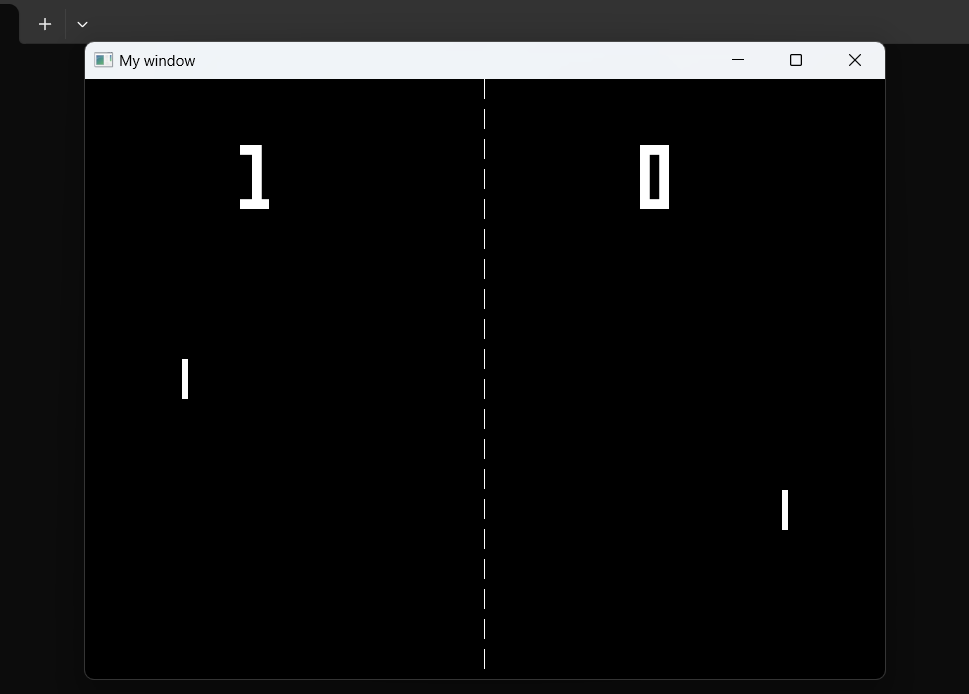
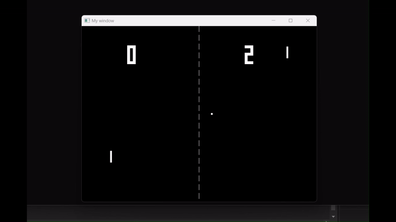

# Pong Game 🏓

 Pong game implemented in C++ using the [SFML (Simple and Fast Multimedia Library)](https://www.sfml-dev.org/).

## 💎 Features 

- Classic Pong gameplay
- Ai that will beat the s**t out of you
- Simple, lightweight design


## 🎥 Screenshots





---

## 📄 Requirements

- Windows OS (for the `.dll` files included in this repository)
- [SFML 2.5+](https://www.sfml-dev.org/download.php) (already included as `.dll` files in this project)
- Visual Studio (or any C++ IDE)

---

## ⬇ Installation

1. **Clone the repository**:
   ```bash
   git clone https://github.com/thom151/pong.git
   cd pong
   ```

2. **Build the Project**:
   - Open `Murph.sln` in Visual Studio.
   - Build the project using the "Release" or "Debug" configuration.

3. **Run the Game**:
   - After building, the executable will be located in the `Release` or `Debug` folder.
   - Ensure the `.dll` files are in the same directory as the executable.

---

## ♻️ Included Dependencies

This repository includes the following SFML `.dll` files:
- `sfml-audio-2.dll`
- `sfml-graphics-2.dll`
- `sfml-network-2.dll`
- `sfml-system-2.dll`
- `sfml-window-2.dll`

These files are required to run the game. If you're missing these files or are using a different operating system, download the appropriate version of SFML [here](https://www.sfml-dev.org/download.php).

---

## 🤝 Contributing

- I'm currently developing the audio and the online multiplayer for this game. But feel free to submit a pull request.

### Submit a pull request

If you'd like to contribute, please fork the repository and open a pull request to the `master` branch.

## 🤝 Need Help?

If you encounter any issues or have questions:
- Open an issue in this repository.
- Contact me at [thomassantos2003@gmail.com](mailto:thomassantos2003@gmail.com)

---

## 🙏 Acknowledgements
- Built using the [SFML library](https://www.sfml-dev.org/).

---

Enjoy playing **Pong**! 🎉
